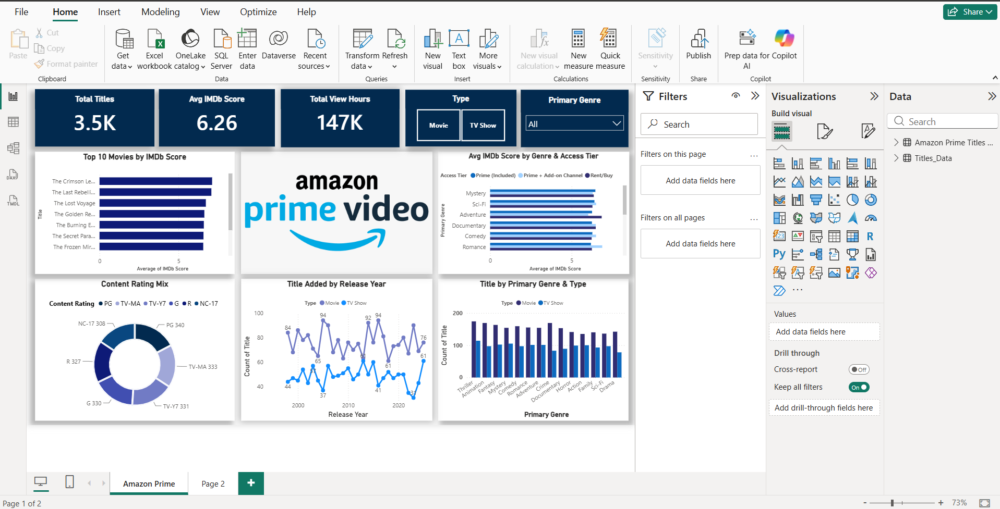
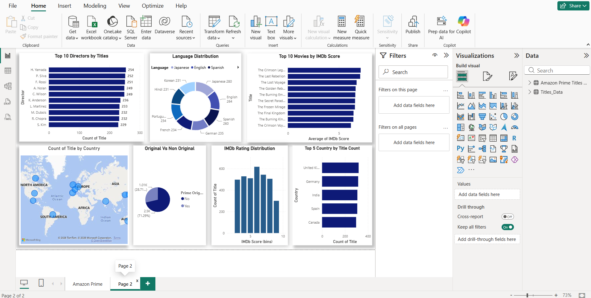

# Amazon Prime Video Dashboard

A Power BI dashboard created to analyze Amazon Prime Video movies and TV shows.

## Dashboard Preview

### Page 1 – Overview

### Page 2 – Analysis

## Project Overview

This dashboard provides an interactive analysis of Amazon Prime Video content, including movies, TV shows, ratings, genres, release years, and content distribution.

## Tools & Technologies

- **Power BI** – Dashboard development and data visualization
- **Power Query** – Data cleaning and transformation
- **Data Modeling** – Building relationships between tables
- **DAX** – Creating measures and calculations
- **Excel** – Dataset preparation and data source

## Dashboard Features

- Total movies and TV shows
- Average IMDb rating
- Movie and TV show distribution
- Content by rating
- Content distribution by country
- Top 10 movies
- Top 10 TV shows
- Genre and category analysis
- Interactive filters and slicers

## Files

- `Amazon Prime Dashboard.pbix` – Power BI dashboard file
- `Amazon Prime Titles Dataset.xlsx` – Dataset used for the analysis
- `amazon_prime_overview.png` – Dashboard overview screenshot
- `amazon_prime_analysis.png` – Dashboard analysis screenshot

## Key Skills Demonstrated

- Data Cleaning
- Data Transformation
- Data Modeling
- DAX
- Data Visualization
- Power BI Dashboard Development
- Data Analysis
