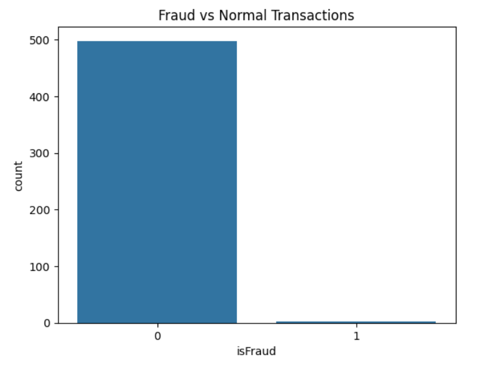
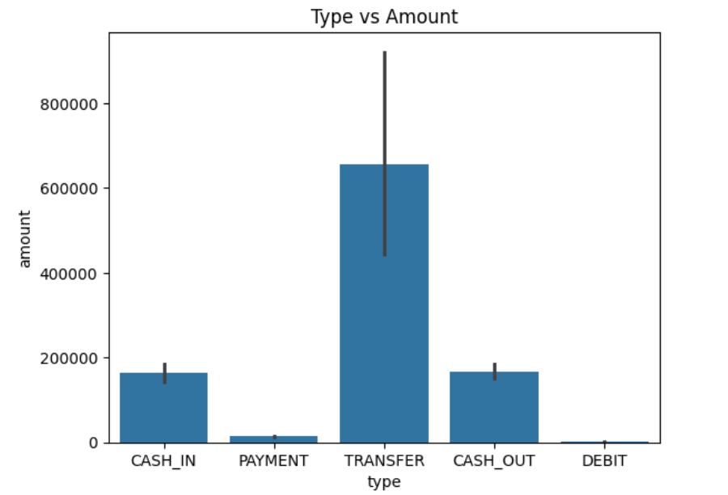
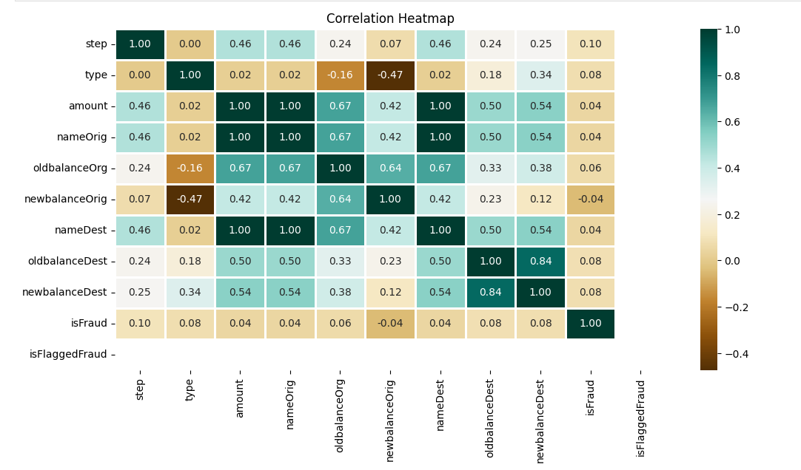
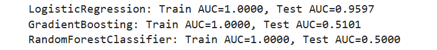
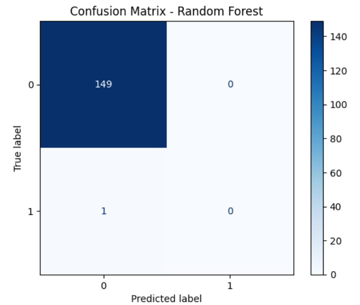

# Online Payment Fraud Detection

A machine learning project that detects fraudulent online payment transactions using Python.

## Problem

Fraudulent transactions cause major financial losses in online payments. The challenge is that the data is highly imbalanced, with fraud cases making up a very small share of all transactions.

## Dataset

- **Source:** [PaySim - Synthetic Financial Datasets For Fraud Detection (Kaggle)](https://www.kaggle.com/datasets/ealaxi/paysim1)
- **Size:** about 6.36 million rows, 11 columns (full dataset). The 500-row sample used here has 500 rows, 11 columns.
- **Target column:** `isFraud` (1 = fraud, 0 = normal)
- This repository includes a 500-row sample (`fraud_sample_500.csv`). The full dataset is available on Kaggle.
- **Sample class balance:** 498 normal, 2 fraud (0.4%).
- **Columns:** `step`, `type`, `amount`, `nameOrig`, `oldbalanceOrg`, `newbalanceOrig`, `nameDest`, `oldbalanceDest`, `newbalanceDest`, `isFraud`, `isFlaggedFraud`

## Tools

Python, Pandas, NumPy, Matplotlib, Seaborn, Scikit-learn

## Approach

1. **Data cleaning and preprocessing:** one-hot encoded the `type` column with `pd.get_dummies(drop_first=True)`; dropped the ID columns `nameOrig` and `nameDest` and the target from the features.
2. **Exploratory data analysis (EDA):** transaction type counts, average amount by type, step distribution with KDE, correlation heatmap, fraud vs normal counts.
3. **Handling class imbalance:** stratified 70/30 train-test split (`stratify=y`) so fraud rows appear in both sets. Resampling (SMOTE) and class weights were not applied in this version and are listed under future work.
4. **Model training:** Logistic Regression, Random Forest, Gradient Boosting.
5. **Model evaluation:** ROC-AUC on train and test sets, a confusion matrix for Random Forest, and a classification report.

## Exploratory Data Analysis

### Fraud vs Normal Transactions

### Average Transaction Amount by Type

### Correlation Heatmap

## Results

Test set: 150 rows (149 normal, 1 fraud).

### ROC-AUC by model

| Model | Train AUC | Test AUC |
|---|---|---|
| Logistic Regression | 1.0000 | 0.9597 |
| Gradient Boosting | 1.0000 | 0.5101 |
| Random Forest | 1.0000 | 0.5000 |

### Random Forest confusion matrix

`[[149, 0], [1, 0]]`

| Metric | Score |
|---|---|
| Accuracy | 0.9933 |
| Precision | 0.00 (no transaction predicted as fraud) |
| Recall | 0.00 (the single fraud case was missed) |
| F1 Score | 0.00 |

## Key Insights

- The sample is extremely imbalanced (2 fraud in 500 rows), so accuracy is misleading: Random Forest scores 99.3% accuracy while missing the only fraud case in the test set.
- Logistic Regression had the best test ROC-AUC (0.96), while the tree-based models were at about 0.50. With only one fraud row in the test set, these scores are not reliable.
- Train AUC of 1.0 for every model points to overfitting on such a small sample.
- TRANSFER transactions have the highest average amount among transaction types.
- **Future work:** train on a larger sample or the full dataset, apply SMOTE or class weights, and report precision, recall and F1 for every model.

## Files

- [Online_Fraud_Detection.ipynb](Online%20Fraud%20Detection.ipynb): full analysis and model code
- [fraud_sample_500.csv](fraud_sample_500.csv): sample of the dataset
- Screenshots (`.png`): charts and results shown above
