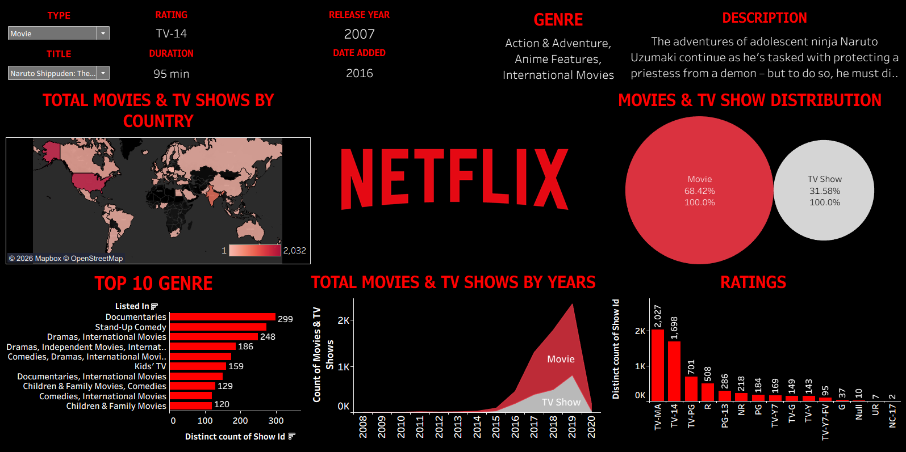

# Netflix Dashboard

An interactive Tableau dashboard created to analyze Netflix movies and TV shows.

## Dashboard Preview

## Project Overview

This dashboard provides insights into Netflix content based on content type, ratings, genres, release years, countries, and content distribution.

## Tools & Technologies

- **Tableau** – Dashboard development and data visualization
- **Data Visualization** – Charts, maps, and interactive visuals
- **Data Analysis** – Analysis of Netflix movies and TV shows
- **Filters** – Interactive content filtering

## Dashboard Features

- Movies and TV Shows distribution
- Content distribution by country
- Top 10 genres
- Content by release year
- Ratings analysis
- Movie and TV Show comparison
- Interactive filters for Type and Title

## Key Skills Demonstrated

- Tableau Dashboard Development
- Data Visualization
- Data Analysis
- Interactive Dashboard Design
- Data Exploration
